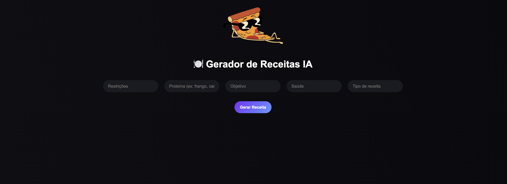
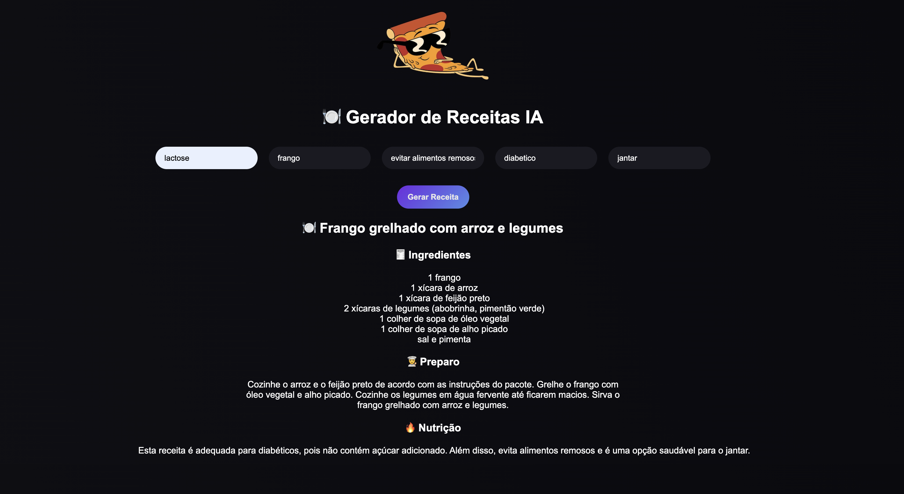

# 🍽️ Gerador de Receitas com IA

---

## 📌 Descrição

O Gerador de Receitas com IA é uma aplicação web que cria receitas personalizadas com base nas preferências do usuário, como tipo de prato, restrições alimentares, objetivo e proteína desejada.

A proposta do projeto é facilitar a escolha de refeições do dia a dia, oferecendo sugestões práticas, acessíveis e adaptadas às necessidades individuais.

---

## 💡 Solução

O sistema utiliza inteligência artificial para gerar receitas únicas e realistas a partir dos dados fornecidos pelo usuário.

A solução funciona da seguinte forma:

1. O usuário informa preferências (restrições, objetivo, tipo e proteína)
2. O frontend envia os dados para o backend
3. O backend processa essas informações e monta um prompt estruturado
4. A IA gera uma receita personalizada
5. O sistema retorna e exibe:
   - Nome da receita
   - Ingredientes
   - Modo de preparo
   - Informações nutricionais

Isso elimina a indecisão na hora de cozinhar e ajuda o usuário a encontrar opções viáveis com o que tem disponível.

---

## 🛠️ Tecnologias Utilizadas

- React.js (Frontend)
- Node.js (Backend)
- Express.js
- API Groq (modelo LLaMA)
- JavaScript (ES6+)
- CSS / Tailwind (estilização)
- LocalStorage (persistência de histórico)

---

## ▶️ Como Executar o Projeto
---
### 🔹 1. Clone o repositório

bash
git clone https://github.com/cyber-keny/Gerador.git   

---

### 🔹 2. Acesse a pasta do projeto

cd seu-repo

### 🔹 3. Instale as dependências

Back-end:
cd backend
npm install

Front-end:
cd ..
cd front-end
npm install

### 🔹 4. Configure o arquivo .env

Na pasta do backend, crie um arquivo .env baseado no .env.example:
API_KEY=sua_chave_aqui

### 🔹 5. Rodando o font-end

cd front-end
npm run dev

### 🔹 6. Rodando o back-end

cd back-end
npm start

### 🔹 7. prints do projeto
Tela inicial do projeto:
   
Tela de resposta:
   